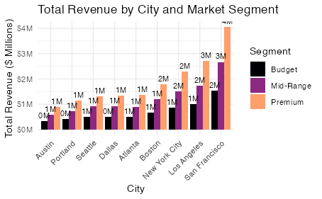

# Electronic_Store_Sales_Analysis
The dataset contains sales data for an electronic store for 12 month in 12 different csv files.
# 📊 Strategic Analysis of Electronics Sales Trends (2019)
**MSc Business Analytics | NEOMA Business School** **Author:** Hein Htet SOE THAN

---

## 🎯 Executive Summary
This project explores a high-volume electronics sales dataset (185,000+ rows) to solve key business challenges regarding **geographic resource allocation** and **price-volume optimization**. By leveraging R and Quarto, I developed a reproducible pipeline to transform raw transaction data into actionable marketing strategies.

<div align="center">
  
  
  
</div>

---

## 🔎 Research Questions & Insights

<table style="width:100%">
  <tr>
    <th style="text-align:left; background-color:#1e293b; color:white; padding:10px;">Research Question</th>
    <th style="text-align:left; background-color:#1e293b; color:white; padding:10px;">Data-Driven Answer</th>
  </tr>
  <tr>
    <td style="padding:10px;"><b>1. Geographic Hubs:</b> Which cities lead in revenue generation?</td>
    <td style="padding:10px;"><b>San Francisco</b> is the leader, generating <b>$8.2M+</b>. Coastal hubs significantly outperform inland cities due to a higher "Premium" product mix.</td>
  </tr>
  <tr>
    <td style="padding:10px;"><b>2. Price Sensitivity:</b> Does higher price reduce volume significantly?</td>
    <td style="padding:10px;">Yes. A negative correlation of <b>-0.89</b> confirms high sensitivity for budget items, while Premium items follow a "Value over Volume" trend.</td>
  </tr>
</table>

---

## 📈 Key Visualizations

### 1. The Revenue Gap (City Distribution)
*Description: This bar chart identifies the top 3 cities (SF, NYC, LA) that account for the majority of the firm's total revenue.*
<br>


### 2. Price-Quantity Correlation Matrix
*Description: The scatter plot reveals the steep decline in quantity as unit price increases, a critical insight for product bundling strategies.*
<br>


---

## 🚀 Strategic Recommendations
1. **Reallocate 20% of Marketing Spend:** Move budget from low-conversion inland cities to high-performing coastal tech hubs.
2. **Implement "Premium Bundling":** Pair high-margin hardware (Laptops) with low-sensitivity budget accessories (Cables) to increase UPT.
3. **Seasonal Optimization:** Target December for "Premium" aggressive campaigns based on the holiday surge data.

---

## 🛠️ Reproducibility Instructions
This project is built to be **fully reproducible**. The `.qmd` file includes an automated download script that pulls the raw data directly from this repository if the local folder is missing.

**To run this project:**
1. Clone the repo: `git clone https://github.com/YourUsername/YourRepo.git`
2. Open `SOE THAN_Hein Htet_FinalProject.qmd` in RStudio or Positron.
3. Render all formats using:
   ```bash
   quarto render "SOE THAN_Hein Htet_FinalProject.qmd"
